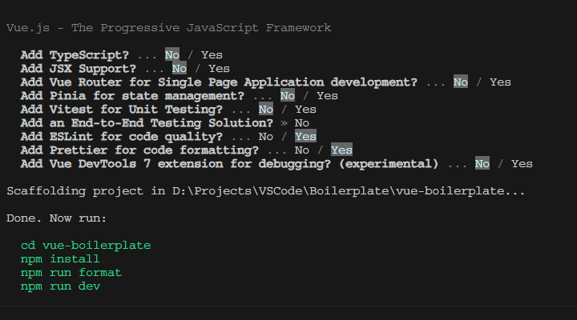
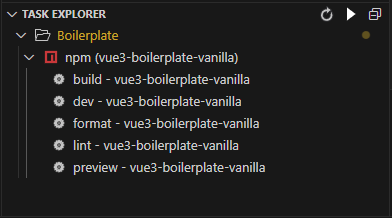

# Vue 3 Boilerplate: Vanilla

This template should help get you started developing with Vue 3 in Vite.

The following options were used during setup:


## Recommended IDE Setup

- [VSCode](https://code.visualstudio.com/) + [Vue - Official extension (previously Volar)](https://marketplace.visualstudio.com/items?itemName=Vue.volar) (and disable Vetur).
- [Task Explorer](https://marketplace.visualstudio.com/items?itemName=spmeesseman.vscode-taskexplorer)
- [Prettier - Code Formatter](https://marketplace.visualstudio.com/items?itemName=esbenp.prettier-vscode)
- [Codeium - AI Coding Autocomplete](https://marketplace.visualstudio.com/items?itemName=Codeium.codeium)

## Customize configuration

To further customize the boilerplate template, have a look at the [Vite Configuration Reference](https://vitejs.dev/config/).

## Project Setup

Once forked, you still need to install the dependencies (node modules) for this template. To do so, run the following command in the terminal:

```sh
npm install
```

## Scripts

Vue comes with a number of commands/scripts defined in the `package.json`.

```js
  "scripts": {
    "dev": "vite",
    "build": "vite build",
    "preview": "vite preview",
    "lint": "eslint . --ext .vue,.js,.jsx,.cjs,.mjs --fix --ignore-path .gitignore",
    "format": "prettier --write src/"
  },
```

You can run these in VSCode directly via the `Run Task` command, or use the terminal.

### Compile and Hot-Reload for Development

```sh
npm run dev
```

### Compile and Minify for Production

```sh
npm run build
```

### Lint with [ESLint](https://eslint.org/)

```sh
npm run lint
```

### Format with Prettier

```sh
npm run format
```

When you have the Task Explorer extension installed, the npm scripts will automatically be picked up and ready to use:


